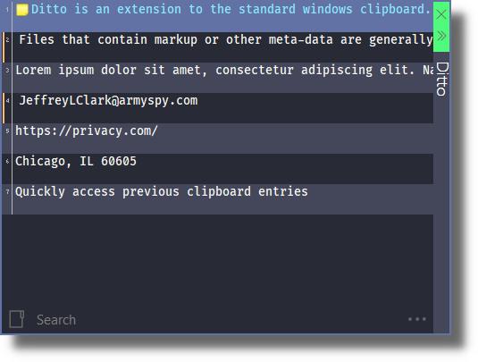

# Dracula for [Ditto](https://ditto-cp.sourceforge.io/)

> A dark Dracula theme for [Ditto](https://ditto-cp.sourceforge.io/).

## Install

All instructions can be found at [draculatheme.com/Ditto](https://draculatheme.com/Ditto).

## Team

This theme is maintained by the following person(s) and a bunch of [awesome contributors](https://github.com/dracula/template/graphs/contributors).

 |
--- |
[Zeno Rocha](https://github.com/zenorocha) |

## License

[MIT License](./LICENSE)
